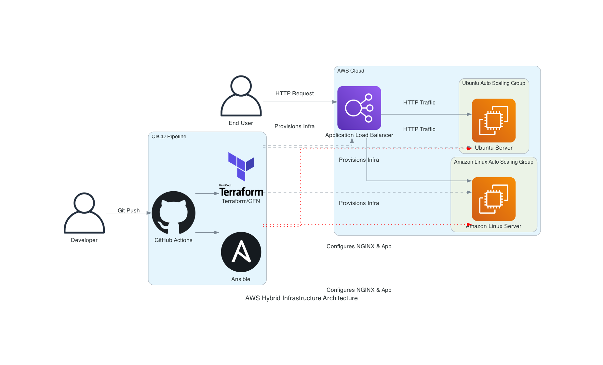

# Project 02: Highly Available Web Architecture with Ansible & Terraform/CloudFormation

This project demonstrates a robust, hybrid infrastructure and configuration management setup. It provisions a highly available AWS infrastructure using Infrastructure as Code (IaC), followed by dynamic application deployment and server configuration using Ansible.

## Architecture



### Key Components

*   **Application Load Balancer (ALB):** Distributes incoming HTTP traffic across healthy EC2 instances in multiple Availability Zones.
*   **Auto Scaling Groups (ASGs):** Automatically maintains the desired number of instances. Two ASGs are configured:
    *   **Ubuntu ASG:** Spins up instances based on the latest Ubuntu 24.04 AMI.
    *   **Amazon Linux ASG:** Spins up instances based on the latest Amazon Linux 2023 AMI.
*   **Dynamic SSM AMI Lookups:** CloudFormation and Terraform automatically resolve the latest base AMIs via AWS Systems Manager Parameter Store.
*   **Ansible (Configuration Management):** Once the servers are online, Ansible connects via SSH to configure NGINX, adjust file permissions based on the specific OS family (Debian vs RHEL), and deploy the web application.
*   **GitHub Actions (CI/CD):** Fully automates the provisioning of infrastructure, the generation of dynamic Ansible inventories, and the execution of Ansible playbooks.

## Project Structure

```sh
.github/workflows/                 # CI/CD Deployment and Teardown pipelines
02-devops-project/
├── app/
│   └── devops/
│       ├── ansible/               # Ansible playbooks and dynamic inventory
│       └── scripts/               # Bash scripts (e.g., generate-inventory.sh)
├── cloudformation/                # CloudFormation stack template
├── terraform/                     # Terraform infrastructure configuration
└── generate_diagram.py            # Script used to generate the architecture diagram
```

## How to Deploy

The entire deployment is fully automated through GitHub Actions.

### Option 1: Deploy with Terraform
1. Navigate to the **Actions** tab in GitHub.
2. Select the `Deploy Project 02 (Terraform & Ansible)` workflow.
3. Click **Run workflow**.

### Option 2: Deploy with CloudFormation
1. Navigate to the **Actions** tab in GitHub.
2. Select the `Deploy Project 02 (CloudFormation & Ansible)` workflow.
3. Click **Run workflow**.

**What happens during deployment:**
1. AWS Infrastructure is provisioned (ALB, ASGs, Security Groups, SSH Keys).
2. The pipeline waits 120 seconds to allow the EC2 instances to fully boot.
3. `generate-inventory.sh` is executed to dynamically query AWS for the new public IPs and builds the Ansible `inventory.ini`.
4. Ansible runs the `install-nginx.yaml` and `deploy-app.yaml` playbooks.
5. The URL for the Application Load Balancer is printed in the workflow summary.
6. The SSH Private Key (`ansible-key.pem`) is uploaded as a GitHub Action Artifact for manual debugging access.

## How to Destroy

To prevent unnecessary AWS costs, you can destroy all provisioned resources with a single click.

1. Navigate to the **Actions** tab.
2. Select the relevant Destroy workflow (`Destroy Project 02 (Terraform)` or `Destroy Project 02 (CloudFormation)`).
3. Click **Run workflow** and type `destroy` to confirm.

All EC2 instances, the Load Balancer, and the Auto Scaling Groups will be terminated automatically.