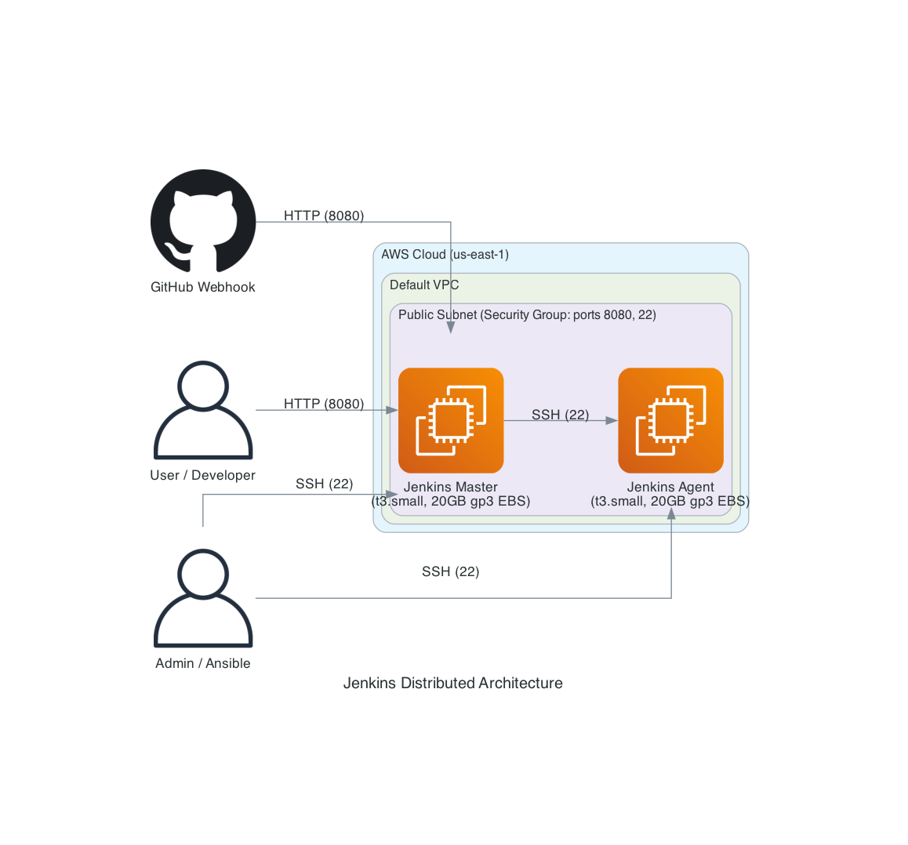

# 🛠️ Deploying a Jenkins CI/CD Server

This project provides the Infrastructure as Code (Terraform) and Configuration Management (Ansible) needed to automatically deploy a fully functional Jenkins CI/CD server on AWS. 

By running this project, you will have a dedicated Jenkins master server ready to orchestrate your other DevOps projects (like Project 04).

## 🏗️ Architecture

1.  **AWS EC2 Instance:** A `t3.small` Ubuntu instance acts as the host for the Jenkins server.
2.  **Security Groups:** Opens Port `8080` for the Jenkins Web UI and Port `22` for SSH (Ansible access).
3.  **Ansible Playbook:** Connects to the EC2 instance, installs Java, configures the Jenkins repository, installs Jenkins, and installs helpful worker tools like Terraform and the AWS CLI.



## 🚀 Deploy Jenkins Server

### 1. Provision the Infrastructure
First, use Terraform to spin up the EC2 instances and Security Groups. This will also automatically generate a secure SSH key locally in your `03-devops-project/ansible` directory.

```bash
cd terraform
terraform init
terraform apply
```

After it finishes, take note of the `jenkins_url` and `jenkins_agent_public_ip` outputs.

### 2. Generate the Ansible Inventory
Wait a minute or two for the EC2 instances to fully boot up, then run the dynamic inventory script.

```bash
cd ../scripts
chmod +x generate-inventory.sh
./generate-inventory.sh
```

### 3. Install and Configure Jenkins Master and Agent
Run the Ansible playbooks. This will SSH into your new EC2 instances to set up the Master and the Agent.

```bash
cd ../ansible
# Configure Master
ansible-playbook -i inventory.ini install-jenkins.yaml

# Configure Agent
ansible-playbook -i inventory.ini install-jenkins-agent.yaml
```

**Look carefully at the Master playbook output!** 
At the end of the run, there will be a `debug` task that prints:
> `"The initial Jenkins admin password is: [YOUR_PASSWORD_HERE]"`

### 4. Complete Jenkins Setup
1. Open the `jenkins_url` in your web browser.
2. Paste the initial admin password retrieved by Ansible.
3. Click **"Install suggested plugins"**.
4. Create your first Admin User.
5. Save and Finish!

## 🔗 Connect Jenkins to GitHub

Once Jenkins is running, you can connect it to your GitHub repository to automate pipeline executions.

### 1. Create a GitHub Personal Access Token (PAT)
1. Go to your GitHub account **Settings** > **Developer settings** > **Personal access tokens** > **Tokens (classic)**.
2. Click **Generate new token (classic)**.
3. Give it a descriptive name (e.g., "Jenkins CI").
4. Select the **`repo`** and **`admin:repo_hook`** scopes.
5. Click **Generate token** and **copy it immediately**.

### 2. Add the Token to Jenkins Credentials
1. Open your Jenkins Dashboard (`http://<your-ec2-ip>:8080`).
2. Go to **Manage Jenkins** > **Credentials**.
3. Under *Stores scoped to Jenkins*, click the **(global)** domain.
4. Click **+ Add Credentials**.
5. Set **Kind** to **Secret text**.
6. Set **Secret** to the GitHub Personal Access Token you copied.
7. Set **ID** to `github-token`.
8. Click **Create**.

### 3. Create a Jenkins Pipeline Job
1. On the Jenkins Dashboard, click **New Item**.
2. Enter a project name, select **Pipeline** (or **Multibranch Pipeline**), and click **OK**.

### 4. Configure the Pipeline
1. In the job configuration, scroll down to the **Pipeline** section.
2. Change the **Definition** dropdown to **Pipeline script from SCM**.
3. Change **SCM** to **Git**.
4. In the **Repository URL** field, paste your repository's HTTPS URL (e.g., `https://github.com/your-username/devops-projects.git`).
5. Under **Credentials**, select `github-token`.
6. Specify the **Branch Specifier** (e.g., `*/main`).
7. Ensure the **Script Path** points to your Jenkinsfile (e.g., `03-devops-project/Jenkinsfile`).
8. Click **Save**.

### 5. Set up Webhooks (To trigger builds automatically)
To make Jenkins run a build every time you push code, configure a webhook.

**In Jenkins:**
1. Go to **Manage Jenkins** > **System** (or Configure System).
2. Scroll to the **GitHub** section.
3. Add a GitHub Server if one doesn't exist, and ensure "Manage hooks" is checked.

**In GitHub:**
1. Go to your repository on GitHub.
2. Click **Settings** > **Webhooks** > **Add webhook**.
3. In the **Payload URL** field, enter your Jenkins URL followed by `/github-webhook/`. *(Example: `http://<your-ec2-ip>:8080/github-webhook/`)*
4. Set **Content type** to `application/json`.
5. Choose **"Just the push event"**.
6. Click **Add webhook**.

### 6. Test the Integration
Push a commit to your repository. Your Jenkins pipeline should automatically trigger and execute your `Jenkinsfile`.

nkins pipeline should automatically trigger and execute your `Jenkinsfile`.

